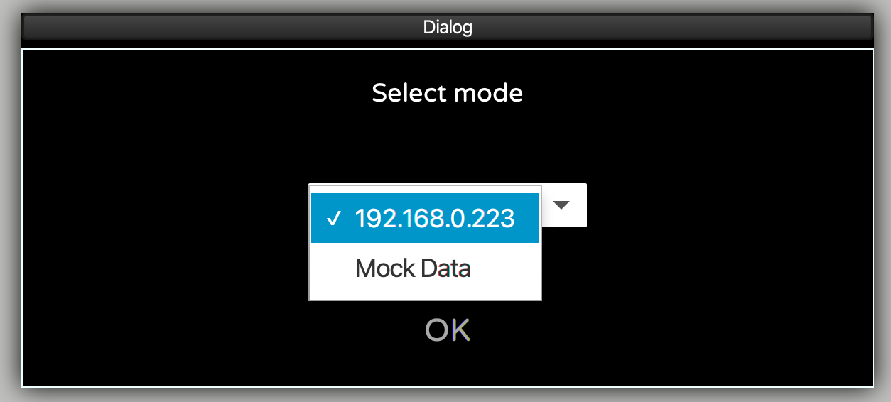
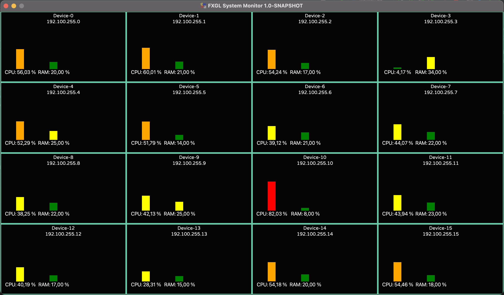
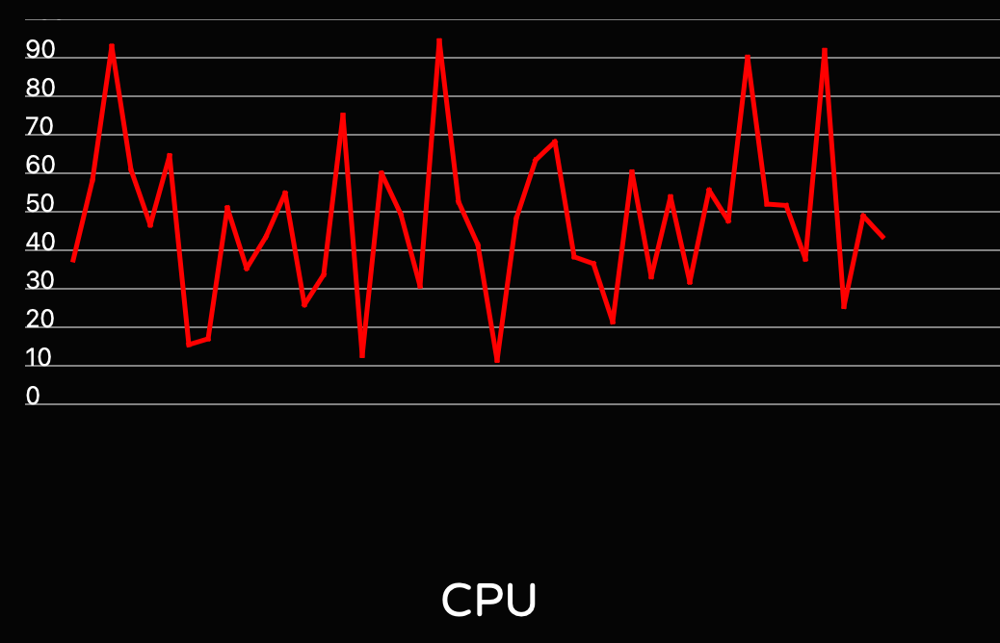

# FXGLSystemMonitoring

Proof-of-concept project to display the state of different devices with JavaFX and FXGL in one dashboard using one
central queue (Mosquitto).

Full description is available on

* [foojay.io]()
* [webtechie.be]()

## Code

### Maven Java and JavaFX project

The dashboard code is available in the "src" directory.

### Python script to send device

One single python-script to run on each Raspberry Pi which needs to be displayed on the dashboard.

If you want to start this script automatically, see
["How to start a python script at boot"](https://raspberrypi.stackexchange.com/questions/108694/how-to-start-a-python-script-at-boot)
.

## Screenshots

