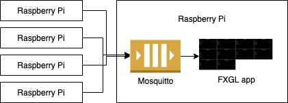
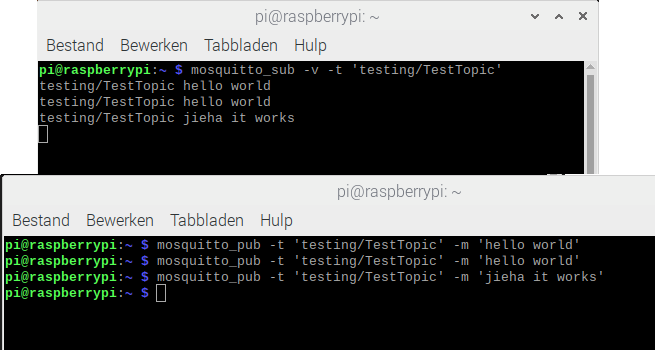

# Device monitoring tool based on JavaFX and FXGL

In a previous post
["Getting Started with FXGL Game Development"](https://foojay.io/today/category/java/javafx/)
we already have taken a look at the [FXGL game development framework](https://github.com/AlmasB/FXGL)
developed by [Almas Baimagambetov](https://twitter.com/AlmasBaim).

But a gaming engine can also be used for other applications. In this post we will be using it for a system monitoring
tool which can run on a Raspberry Pi to monitor any device which can report its state to a queue.

## Diagram

For this post a proof-of-concept has been set up using a Raspberry Pi as the "central system" to host the queue (
Mosquitto) and run the JavaFX dashboard.



### Installing Mosquitto on the Raspberry Pi

Installing Mosquitto can be done with the following commands, which will also configure it as a service which will start
whenover your Raspberry Pi is (re)powered.

```
$ sudo apt update
$ sudo apt install -y mosquitto mosquitto-clients
$ sudo systemctl enable mosquitto.service
```

Now we can check if it is installed correctly and running:

```
$ mosquitto -v
1569780732: mosquitto version 1.5.7 starting
1569780732: Using default config.
1569780732: Opening ipv4 listen socket on port 1883.
1569780732: Error: Address already in use
```

The last line with the error message can be ignored.

### Testing Mosquitto on the Pi

We can easily test if Mosquitto is running OK on the Pi, by opening two terminal windows. In the first one we start a
listener on topic "testing/TestTopic":

```
$ mosquitto_sub -v -t 'testing/TestTopic'
```

In the second terminal we send multiple commands with a message for this topic, like this:

```
$ mosquitto_pub -t 'testing/TestTopic' -m 'hello world'
$ mosquitto_pub -t 'testing/TestTopic' -m 'hello world'
$ mosquitto_pub -t 'testing/TestTopic' -m 'jieha it works'
```

Every "publish" from the second terminal window will appear in the first one.

{width: 80%}


## Send state from Raspberry Pi

To send the state from another Raspberry Pi to Mosquitto, a separate app is available on GitHub. For this script we are
using Python as we only need some minimal example data which is easily available in Python. Of course the same could be
done with Java, but let's embrace Python for once ;-)

### Extra dependencies

If you started from the default Raspberry Pi OS, Python is already installed, we only need to add two extra libraries
with the pip-command to send data to the queue (with paho) and get device status info (with psutil).

```
pip install paho-mqtt
pip install psutil
```

In this example we are only using a subset of all the data which is available from psutil to show as a proof-of-concept.
A full overview is available on [pypi.org/project/psutil](https://pypi.org/project/psutil/).

## Monitoring application

The [sources of this application are available on GitHub](https://github.com/FDelporte/FXGLSystemMonitoring).

### Test extra load

```
$ sudo apt install stress
$ stress --cpu 2
```

## Conclusion