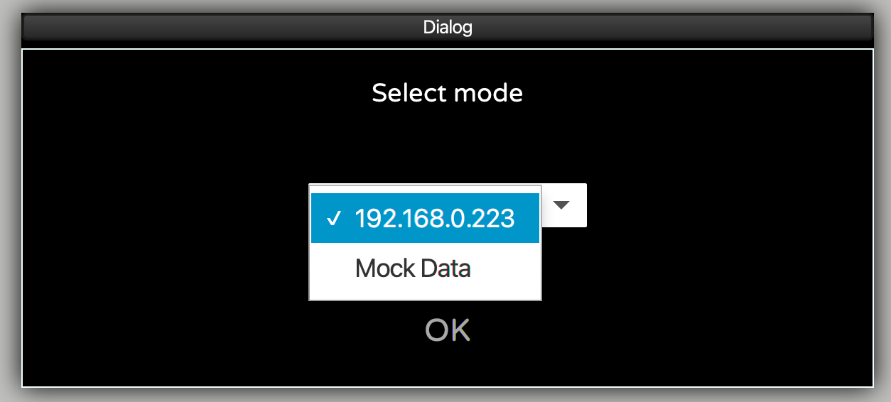
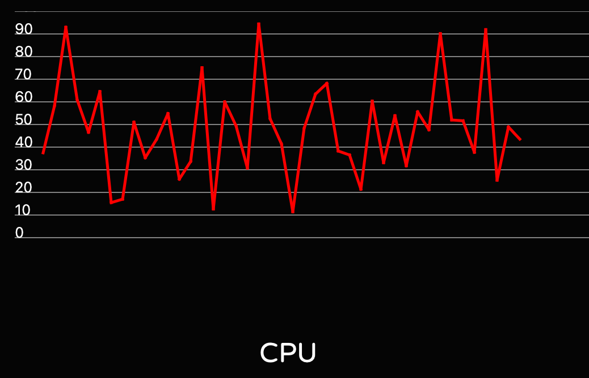

# Device monitoring tool based on JavaFX and FXGL

In a previous post
["Getting Started with FXGL Game Development"](https://foojay.io/today/category/java/javafx/)
we already have taken a look at the [FXGL game development framework](https://github.com/AlmasB/FXGL)
developed by [Almas Baimagambetov](https://twitter.com/AlmasBaim).

But, this gaming engine can also be used for other use-cases. In this post we will be building a system monitoring
dashboard which can run on a Raspberry Pi to keep an eye on any device which can report its state to a queue.

## Application description

For this post a proof-of-concept has been set up using one Raspberry Pi as the "central system" to host the queue
(Mosquitto). On this Raspberry Pi and others, a Python script runs to send the device state every second to this queue.
For every new device (IP address) which appears in the list, a new "tile" is created to show some of the data. By
clicking on this tile, a new screen is opened with a chart.


When the application starts, you can choose between "Mock Data", or an IP address of the board with the queue. This
video shows the mocked result:

https://vimeo.com/497975677

The sources of this project are available on
[GitHub in the FXGLSystemMonitoring repository](https://github.com/FDelporte/FXGLSystemMonitoring).

## Mosquitto

[Eclipse Mosquitto](https://mosquitto.org/) is an open-source message broker that implements the MQTT protocol which is
lightweight and is suitable for use on all devices from low power single board computers to full servers. As such, it's
a perfect match to use on the Raspberry Pi.

### Installing Mosquitto on the Raspberry Pi

Installing Mosquitto can be done with the following commands, which will also configure it as a service to start
whenever your Raspberry Pi is (re)powered.

```
$ sudo apt update
$ sudo apt install -y mosquitto mosquitto-clients
$ sudo systemctl enable mosquitto.service
```

We can check if it is installed correctly and running by requesting the version:

```
$ mosquitto -v
1569780732: mosquitto version 1.5.7 starting
1569780732: Using default config.
1569780732: Opening ipv4 listen socket on port 1883.
1569780732: Error: Address already in use
```

The last line with the error message can be ignored.

### Testing Mosquitto on the Pi

The installed mosquitto-clients can be used to easily test if Mosquitto is running OK on the Pi, by opening two terminal
windows. In the first one we start a listener on topic "testing/TestTopic":

```
$ mosquitto_sub -v -t 'testing/TestTopic'
```

In the second terminal we send multiple commands with a message for this topic, like this:

```
$ mosquitto_pub -t 'testing/TestTopic' -m 'hello world'
$ mosquitto_pub -t 'testing/TestTopic' -m 'hello world'
$ mosquitto_pub -t 'testing/TestTopic' -m 'jieha it works'
```

Every "publish" from the second terminal window will appear in the first one as you can see in these screenshots:

{width: 80%}


## Send state from Raspberry Pi

To send the state from all our Raspberry Pi-boards to Mosquitto, a
[Python script is available in the GitHub project](https://github.com/FDelporte/FXGLSystemMonitoring/blob/main/python/statsSender.py)
. For this script we are using Python as we only need some minimal example data which is easily available with the "
psutil"
library. Of course the same could be done with Java, but let's embrace Python for once ;-)

### Extra dependencies

If you started from the default Raspberry Pi OS, Python is already installed, we only need to add two extra libraries
with the pip-command to send data to the queue (with paho) and get device status info (with psutil).

```
pip install paho-mqtt
pip install psutil
```

In this example we are only using a subset of all the data which is available from psutil to show as a proof-of-concept.
A full overview is available on [pypi.org/project/psutil](https://pypi.org/project/psutil/).

A small part of the Python-code shows how the virtual memory info is transferred:

```
virtual = psutil.virtual_memory()

jsonString = "{"
...
jsonString += " 'virtual_memory': {"
jsonString += "   'total':'" + str(virtual.total) + "',"
jsonString += "   'available':'" + str(virtual.available) + "',"
jsonString += "   'used':'" + str(virtual.used) + "',"
jsonString += "   'free':'" + str(virtual.free) + "',"
jsonString += "   'percent':'" + str(virtual.percent) + "'"
jsonString += " },"
...
jsonString = "}"
```

With the paho-library we can send messages to the queue with:

```
client = paho.Client(hostname + ":" + str(address))
client.connect(mosquitto)
client.publish(topicName, jsonString)
```

## Inside the monitoring application

The application starts in MonitorApp which extends an FXGL GameApplication.

The [Java/JavaFX/FXGL Maven project](https://github.com/FDelporte/FXGLSystemMonitoring) is organized in data-, queue-
and view-packages to make the code easy to understand. Besides the expected FXGL-specific overrides
(initSettings, initGame), we can find some nice examples of the additional features FXGL provides.

For example the dialog box at start-up to select mock or real mode:

```
runOnce(() -> {
    var choiceBox = getUIFactoryService().newChoiceBox(
            FXCollections.observableArrayList("192.168.0.223", "Mock Data")
    );
    choiceBox.getSelectionModel().selectFirst();

    var btnOK = getUIFactoryService().newButton("OK");
    btnOK.setOnAction(e -> {
        var result = choiceBox.getSelectionModel().getSelectedItem();
        if ("Mock Data".equals(result)) {
            startWithMockData();
        } else {
            getExecutor().startAsync(() -> startWithClient(result));
        }
    });

    getDialogService().showBox("Select mode", choiceBox, btnOK);
}, Duration.seconds(0.01));
```

Another one is the run-method which generates random data for the mock-mode using noise1D:

```
run(() -> monitors.forEach(m -> {
    var t = random(0.5, 150000.0);

    var reading = new Reading(
            noise1D(t * 7) * 100,
            (long) (noise1D((t + 1000) * 2) * 40),
            (long) (noise1D((t + 3000) * 3) * 75)
    );

    m.onReading(reading);
}), DATA_UPDATE_FREQUENCY);
```

### Incoming data

By using JSONB the incoming data is converted to Java objects. Let's look for example at the VirtualMemory-class which
maps the Python data to a Java object. Each JsonbProperty has a name-value which is not required if the variable has the
same name, but for clarity I prefer to still define it to avoid errors later when the Java-variable would be renamed.

```
public class VirtualMemory {
    @JsonbProperty("total")
    private long total;

    @JsonbProperty("available")
    private long available;

    @JsonbProperty("used")
    private long used;

    @JsonbProperty("free")
    private long free;

    @JsonbProperty("percent")
    private double percent;

    public VirtualMemory() {
        // NOP needed for JSON mapping
    }

    // Getters - Setters
}
```

### Qeueu

By using the ["org.eclipse.paho.client.mqttv3" dependency](https://www.eclipse.org/paho/), connecting to the queue is
pretty easy.

```
MqttClient client = new MqttClient("tcp://" + ipAddress + ":1883", MqttClient.generateClientId());
client.setCallback(new ClientCallback(readings));
client.subscribe(topicName);
```

The ClientCallBack gets called each time a message is available in the topic.

```
@Override
public void messageArrived(String s, MqttMessage mqttMessage) {
    String data = new String(mqttMessage.getPayload());
    System.out.println("Message received: " + data);
}
```

### The view components

All the views are split into separate JavaFX Nodes making clever use of boxes, lines,...

TODO Almas can you provide a little etra info here?

### Running the application with Mock data

When the application starts, you have the choice to select between an IP address of the Raspberry Pi with the Mosquitto
queue and "Mock Data". After selecting this second option 16 devices will be created inside the application which
generate random data. This is ideal to test all functions of the application.





### Running the application with real data

Restart the application and select the IP address. As soon as data is received from a device with a new IP address, a
new tile is created to visualize the data. Start the Python script on a few devices to see the result as shown in the
video below.

https://vimeo.com/497976030

As you can see in the video, my Pi's are not very busy. By using the stress-tool we can trigger additional load on the
device to test the visualization in our dashboard.

On my Raspberry Pi (B4 8Gb memory) the cpu-command only impacts the CPU value, while the vm-command causes both higher
CPU and memory usage.

```
$ sudo apt install stress
$ stress --cpu 2
$ stress --vm 4 --vm-bytes 1024M
```

## Conclusion

Yes I know, something similar could be done with the magnificent
[TilesFX library of Gerrit Grunwald](https://github.com/HanSolo/tilesfx) but we deliberately took another approach to
show you how you can create visualization components with JavaFX and FXGL yourself. Combined with the right libraries
for JsonB and Paho, Java proves again that very powerful applications can be created with minimal code which is easy to
read and extend.

As this is just a proof-of-concept, there is still a lot of room for improvement... Just a few ideas:

* Indicate devices which haven't sent data in the last X seconds and turn the view background to red
* Combine multiple values on the chart
* Provide additional info on the expanded view
* ...

Feel free to use this project as a starting-point or as inspiration, but please share what you have created!